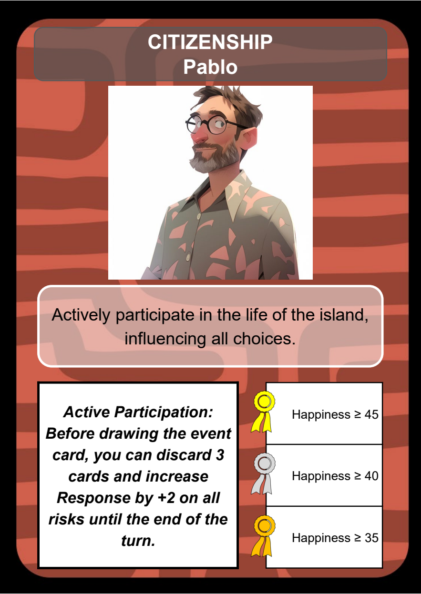
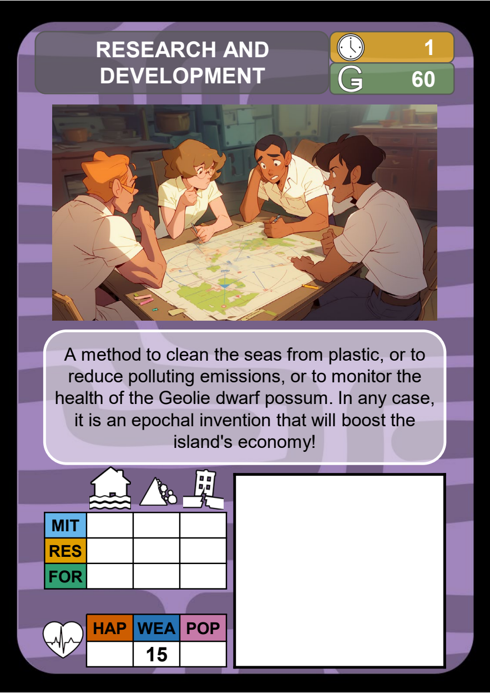
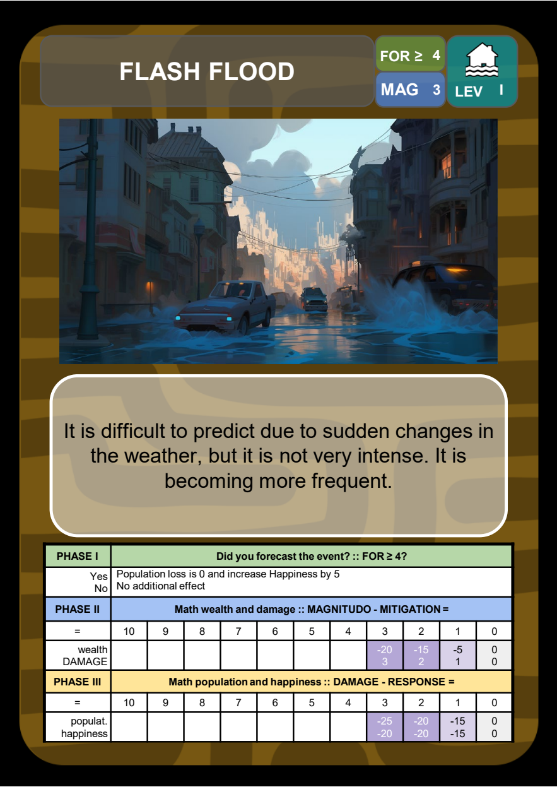
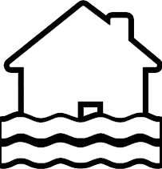
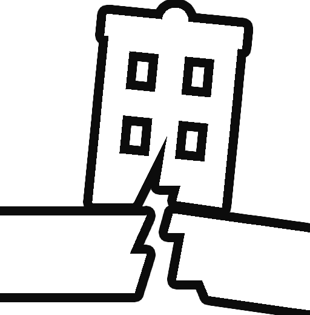
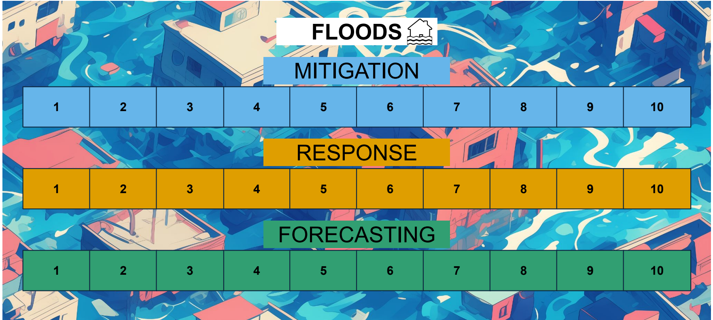

# Dangers & Dwellers

**Six years to protect Geolie. One island. A shared treasury.**

Dangers & Dwellers is a tabletop game about managing natural hazards and negotiating public investment. Players represent the island's stakeholders, choosing how to prepare for floods, landslides and earthquakes. Everyone needs the island to survive; each stakeholder also pursues its own medal conditions.

<p align="center">
  
  
  
</p>

| At the table | |
| --- | --- |
| Roles | 4–8 different stakeholders, played individually or in teams |
| Game length | 6 years / rounds |
| Decisions | Propose actions, negotiate, vote and invest a common budget |
| Hazards | Floods, landslides and earthquakes |
| Shared challenge | Keep Happiness, Wealth and Population above zero |
| Personal goals | Earn the highest available stakeholder medal |
| Materials | English cards, boards and two editable rulebooks |

## Start here

- **[Short rulebook — 4 pages](rulebook/en/dangers-and-dwellers-short.docx)** for learning the core rules and checking them during play.
- **[Extended rulebook — 8 pages](rulebook/en/dangers-and-dwellers-extended.docx)** for setup, abilities, timing and a worked Event example.
- **[Materials and printing](docs/materials.md)** for the component list and preparation guide.
- **[Presentazione in italiano](docs/overview.it.md)** for an Italian project summary.

The rulebooks are the current review editions. Both use the same rules; the shorter edition relies on the cards for individual ability details.

## English game files

| Download | Contents | PDF pages |
| --- | --- | ---: |
| [Action cards](cards/en/action-cards.pdf) | 94 card fronts, with their printed backs | 47 |
| [Event cards](cards/en/event-cards.pdf) | 22 card fronts, with their printed backs | 11 |
| [Character cards](cards/en/character-cards.pdf) | 32 portraits across 8 stakeholder roles, with backs | 16 |
| [Boards](boards/en/boards.pdf) | Island Board, 3 hazard boards and Timeline | 3 |

The PDFs are unchanged copies of the English source files. [Source records and checksums](docs/sources.md) identify the imported material.

## How a year works

1. **Invest.** Activate scheduled actions, draw, propose cards and vote. Normally, the two selected actions are funded from the common treasury.
2. **Face the Event.** Forecast determines protection; Mitigation reduces the Event's Magnitude; Response reduces the remaining Damage.
3. **Close the year.** Check survival and collect income based on current Wealth. Prepare the next year or, after year 6, award medals with temporary bonuses still active.

Read the rulebook for complete timing, costs and voting rules. If any island health statistic reaches zero after applicable protection, everyone loses.

## Read the island

| Symbol | Meaning |
| --- | --- |
|  | Island health: Happiness, Wealth and Population |
|  | Flood hazard |
|  | Landslide hazard |
|  | Earthquake hazard |

<p align="center"></p>

## Project contents

```text
cards/en/          English Action, Event and Character PDFs
boards/en/         English boards PDF
rulebook/en/       Extended and short English DOCX rulebooks
assets/images/    Illustrations and component previews from the game
assets/icons/     Original game symbols and statistic labels
docs/             Project overview, materials and source records
```

## Authors

Created by **Samuele Segoni, Emanuele Intrieri and Francesco Cardi**.

See [AUTHORS.md](AUTHORS.md) for credits, [CHANGELOG.md](CHANGELOG.md) for repository updates and [CONTRIBUTING.md](CONTRIBUTING.md) to propose corrections or report a playtest.
