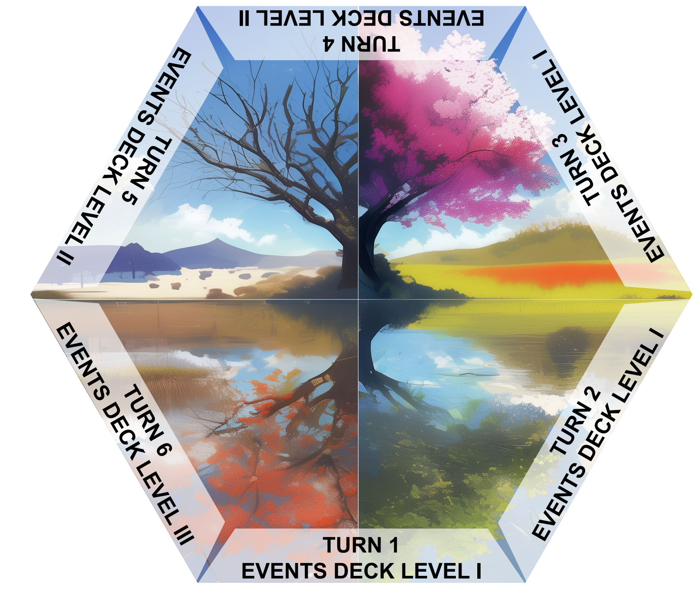

# Materials and printing

## Files to prepare

| Material | File | Use |
| --- | --- | --- |
| Action cards | [action-cards.pdf](../cards/en/action-cards.pdf) | Separate into the stakeholder decks |
| Event cards | [event-cards.pdf](../cards/en/event-cards.pdf) | Separate by Level I, II and III |
| Character cards | [character-cards.pdf](../cards/en/character-cards.pdf) | Choose one portrait for each participating role |
| Boards | [boards.pdf](../boards/en/boards.pdf) | Lay out the Island Board, the three hazard boards and the Timeline |
| Rules | [Short](../rulebook/en/dangers-and-dwellers-short.docx) or [extended](../rulebook/en/dangers-and-dwellers-extended.docx) | Keep available at the table |

The card PDFs contain both fronts and backs in their original page layout. Counts in the project README refer to playable fronts, not every printed panel. The Character deck contains four portraits for each of eight roles; portraits of the same role have the same rules.

## Print and assemble

1. Check the PDF preview and paper size before printing. Print at actual size to preserve the source dimensions.
2. Make a test print of a single sheet first. Check front/back position and orientation before printing the whole set. The source sheets include backs on the same page: do not assume they are already ordered as an automatic duplex deck.
3. Cut the components following their boundaries. Use sleeves with opaque backing or mount the corresponding front and back together.
4. Keep stakeholder Action decks separate, and sort Event cards by level.

Provide **12 statistic markers**, **1 turn marker**, **1 vote token per stakeholder**, and a way to track the shared treasury in Geuros. A distinct starting-player marker is also useful. Tokens and money are not supplied as separate printable files in this repository.

## Set the table

Start Happiness, Wealth and Population at **50**, all nine defence values at **0**, and the treasury at **200 Geuros**. Each stakeholder draws three Action cards. Prepare three Level I Events, two Level II Events and one Level III Event for the six years. The rulebook gives the complete setup and play sequence.

## Choosing a rulebook

The four-page version covers the core procedure and medal conditions. The eight-page version adds the complete ability summary, income table and more guidance on timing. Both contain the same standard Event calculation example and the same final medal timing.
